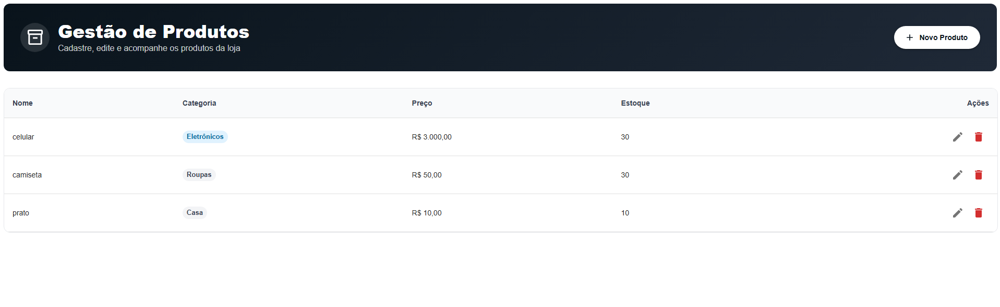
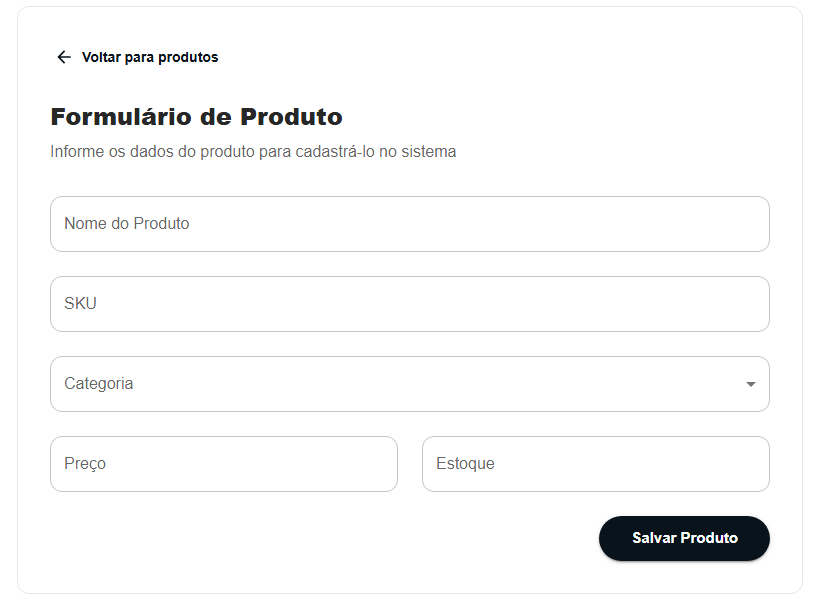
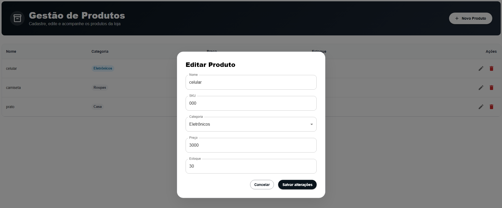
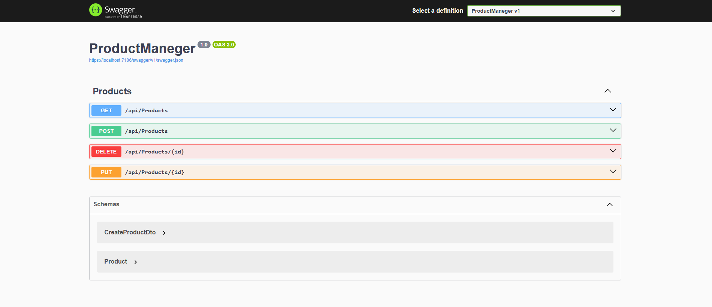

# Product Manager Fullstack

Sistema fullstack para gerenciamento de produtos desenvolvido com React + ASP.NET Core.

---

# Tecnologias utilizadas

## Frontend

* React
* TypeScript
* Material UI
* React Query
* React Hook Form
* Zod
* Axios
* Vite

## Backend

* ASP.NET Core
* Entity Framework Core
* SQLite
* Swagger

# Screenshots

## Dashboard



## Cadastro de Produto



## Modal de Edição



## Swagger



---

# Funcionalidades

✅ Cadastro de produtos

✅ Listagem de produtos

✅ Edição de produtos

✅ Exclusão de produtos

✅ Validação de dados no frontend e backend

✅ Validação de SKU único

✅ Modal de edição

✅ Integração completa entre frontend e backend

---

# Regras de negócio

* Produtos eletrônicos devem possuir valor mínimo de R$ 50,00
* O estoque não pode possuir valor negativo
* O SKU deve ser único

---

# Como rodar o projeto

## Backend

### Entrar na pasta da API

```bash
cd ProductManeger
```

### Restaurar dependências

```bash
dotnet restore
```

### Rodar API

```bash
dotnet run
```

A API será iniciada normalmente em:

```txt
https://localhost:7106
```

O Swagger estará disponível em:

```txt
https://localhost:7106/swagger
```

---

## Frontend

### Instalar dependências

```bash
npm install
```

### Rodar aplicação

```bash
npm run dev
```

O frontend será iniciado normalmente em:

```txt
http://localhost:5173
```

---

# Banco de dados

O projeto utiliza SQLite.

O banco é criado automaticamente através do Entity Framework Core.

Arquivo do banco:

```txt
products.db
```

---

# Como visualizar as tabelas do banco

## Utilizando DB Browser for SQLite

Download:

[https://sqlitebrowser.org/](https://sqlitebrowser.org/)

### Passos

1. Abrir o DB Browser
2. Clicar em "Open Database"
3. Selecionar o arquivo:

```txt
products.db
```

4. Abrir a aba:

```txt
Browse Data
```

5. Selecionar a tabela:

```txt
Products
```

---

# Estrutura do projeto

## Frontend

```txt
src/
├── api/
├── components/
├── hooks/
├── pages/
├── routes/
├── schemas/
├── services/
├── theme/
└── types/
```

## Backend

```txt
ProductManeger/
├── Controllers/
├── DTOs/
├── Data/
├── Models/
└── Migrations/
```

---

# Arquitetura utilizada

A aplicação utiliza DTOs para desacoplar a camada da API das entidades do banco de dados, garantindo melhor manutenção, organização e separação de responsabilidades.

Também foi utilizado React Query para gerenciamento de cache e sincronização automática dos dados após operações de criação, edição e exclusão.

---

# Autor

Desenvolvido por Sabrina Ribeiro.
